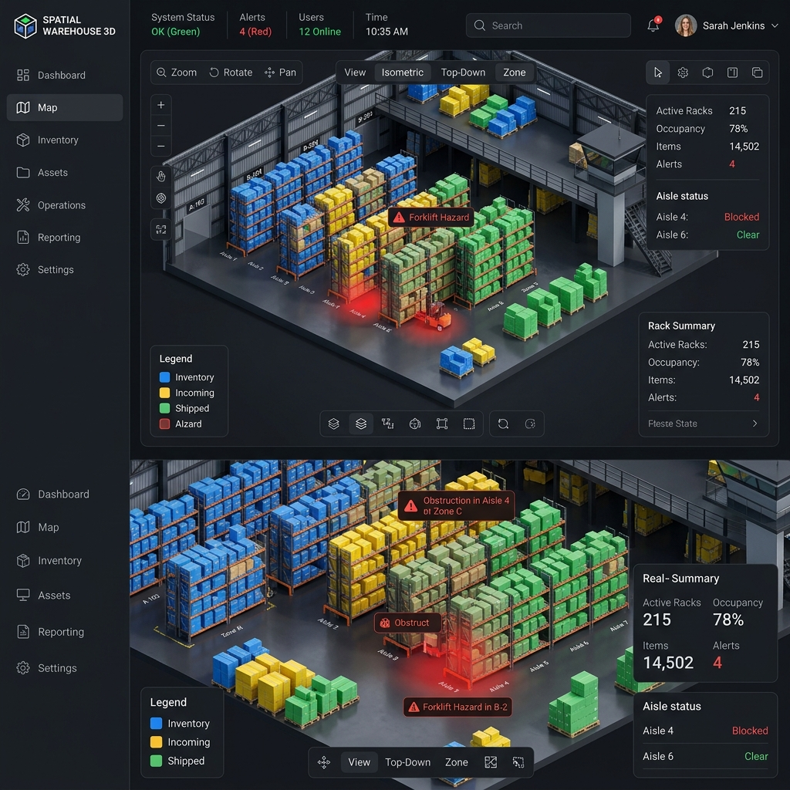

# SpatialWarehouse 3D



An interactive 3D warehouse floor spatial modeling and photogrammetry simulation tool built with Three.js and FastAPI. The application enables users to visualize warehouse layouts, model objects using photogrammetry simulations (Meshroom simulator), calculate spatial utilization, and monitor active safety/collision hazards.

## Key Features

- **Interactive 3D Floor Map**: Rendered via Three.js with full OrbitControls support (Zoom, Pan, Rotate).
- **Agile Sprint View**: Switch dynamically between development sprints (Sprint 1 to Sprint 5).
- **Meshroom Photogrammetry Pipeline**: Simulated background processing of image sequences to reconstruct and place new items into the 3D space.
- **Computer Vision Helper (`cv_engine.py`)**: Estimates 3D bounding boxes from image metadata and performs real-time safety hazard detection (e.g. forklift pathways, blocked fire exits).
- **Analytics Dashboard**: Tracks spatial capacity, active racks, items, and warning/hazard counts.

## Architecture

```text
spatial-warehouse-3d/
├── assets/                    # Project graphics & preview images
├── static/                    # Frontend client files
│   ├── index.html             # Application UI structure
│   ├── index.css              # Glassmorphic and responsive styling
│   ├── app.js                 # Dashboard controller & API orchestration
│   └── three-view.js          # Three.js scene setup and rendering logic
├── cv_engine.py               # Spatial CV simulation & calculations
├── database.json              # Mock persistent database storing 3D objects
├── main.py                    # FastAPI server & endpoints
├── meshroom_pipeline.py       # Simulated photogrammetry worker thread
└── test_backend.py            # Unit testing suite
```

## Running the Project

1. Install dependencies:
   ```bash
   pip install -r requirements.txt
   ```

2. Run the FastAPI application:
   ```bash
   python main.py
   ```

3. Open `http://localhost:8000/static/index.html` in your browser.
